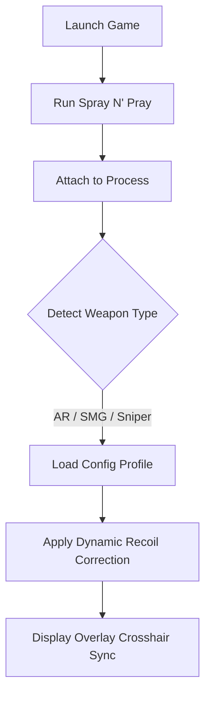

# Spray N’ Pray Cheat – Precision Shooter Enhancement & Config Suite 🔫

The **Spray N’ Pray Cheat** is a next-generation accuracy optimizer for PC shooters, giving players granular control over recoil, weapon spread, and targeting stability. Built for smooth injection, minimal delay, and instant feedback, it’s a pro-level toolkit made for those who demand clean precision — not chaos. Whether you’re climbing ranked ladders or testing weapon patterns, this software helps you dominate every encounter.

---

## 🧭 Overview

Unlike traditional recoil macros, this system dynamically adjusts to your active weapon, using algorithmic pattern correction rather than fixed offsets. It works across multiple titles that share ballistic spread models, ensuring your accuracy feels consistent, no matter the map or gun.

> [!IMPORTANT]
> Always launch the software **after** your game starts to ensure real-time weapon calibration.


---

## 🎯 Core Features

* **Dynamic Recoil Stabilizer:** Recalibrates aim path every frame for consistent grouping.
* **Crosshair Sync AI:** Adjusts on-screen aim visuals to match ballistic corrections.
* **Precision Lock:** Soft-aim assist that tightens spread at medium range without overcompensation.
* **Spray Pattern Memory:** Learns your last five recoil movements to predict and adjust automatically.
* **Smart Weapon Detection:** Identifies equipped gun class (SMG, AR, Sniper) and loads custom profiles.
* **Instant Toggle Mode:** Activate/deactivate via hotkey (`F4` default) or controller input.
* **Config Manager:** Save unlimited recoil or FOV presets for multiple playstyles.

---

## 💻 Compatibility

| Platform                        | Version          | Status                |
| ------------------------------- | ---------------- | --------------------- |
| Windows 10 / 11                 | x64              | ✅ Supported           |
| Steam / Epic / Custom Launchers | All              | ✅ Compatible          |
| Controller                      | Xbox / DualSense | ⚙️ Fully Mapped       |
| Linux (Proton)                  | Partial          | ⚠️ No Overlay Support |

> [!NOTE]
> The software automatically detects DirectX or Vulkan rendering for optimal synchronization.

---

## ⚡ Setup Guide

1. **Extract** `SprayNPray_Cheat.zip` into your preferred folder.
2. **Launch** the game first.
3. **Run** `SNP_Controller.exe` as Administrator.
4. Wait for the *Connected to Process* message.
5. Press `F4` to activate — your crosshair will flash briefly to confirm sync.

Example configuration snippet:

```ini
[CheatConfig]
AutoAim=False
RecoilControl=0.85
CrosshairSync=True
PatternMemory=True
SensitivityScale=1.1
```

> [!WARNING]
> Using extreme sensitivity scaling values may desync aim tracking; stay between `0.8`–`1.3` for accuracy.

---

## 🧩 Function Flow



---

## 🧠 Advanced Features

### 🔄 Auto-Profile Switching

The system detects recoil shift patterns unique to each weapon and swaps configs mid-game without restarting.

### 📊 Analytics Overlay

Real-time feedback graph shows deviation angles, recoil compensation rate, and average hit spread:

```
Recoil Compensation: 91%
Shot Deviation: 0.03°
Stability Index: 98.2%
```

### 💾 Preset Loader

Switch between saved profiles like:

* `Balanced_Assault.ini` – 0.9 recoil, 1.05 sensitivity
* `CloseCombat_SMG.ini` – 0.7 recoil, FOV 105°
* `Marksman_Sniper.ini` – 0.95 accuracy, zoom balance

---

## ❓ FAQ

**Q1: Does this affect hit registration or damage?**
No — it only modifies client-side control and aim stability, not server logic.

**Q2: Can I use it in online ranked matches?**
Use caution; the tool is for testing, training, and private sessions.

**Q3: Are configs shareable?**
Yes, export `.ini` files and import them on other PCs.

**Q4: Will updates break functionality?**
Automatic version sync checks for game patches and adjusts memory offsets as needed.

**Q5: How do I disable the overlay?**
Press `F9` or toggle “Overlay=False” in your config file.

---

## 🧠 Pro Tips

* Combine **Precision Lock** with low FOV for tighter headshot ratios.
* Use **Pattern Memory** to train muscle memory on recoil-heavy weapons.
* Adjust **CrosshairSyncDelay** (default `0.02s`) to match your monitor’s refresh rate for perfect visual alignment.

---

## 🌐 Community & Support

Join the Spray N’ Pray discussion hub for shared configs, setup screenshots, and live update notifications.

---

### Final Thoughts

The **Spray N’ Pray Cheat** isn’t just a performance tweak — it’s a complete *precision platform*. With its adaptive recoil logic and seamless weapon recognition, it redefines control for both casual training and serious marksmanship testing.

> Upgrade your accuracy. Sharpen your reflexes. **Install Spray N’ Pray and command every shot.**
